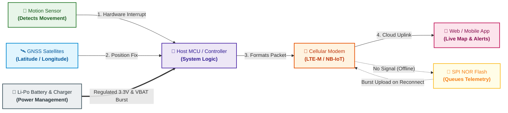
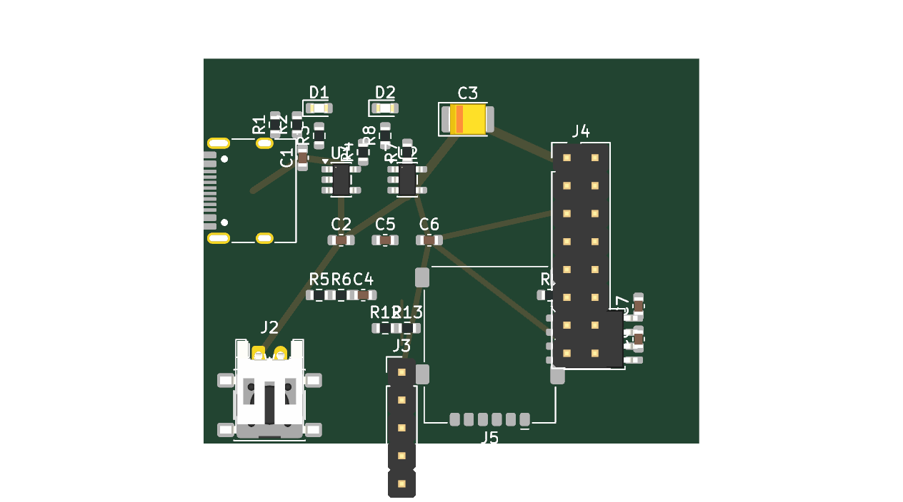

# AtlasTag


> **AtlasTag** is an ultra-compact, long-battery-life hardware asset-tracking platform combining GNSS satellite positioning, cellular IoT connectivity (LTE-M / NB-IoT), motion-triggered intelligence, and local fail-safe telemetry storage. Developed for **Hack Club Half Life**.

---

## Concept & Vision Reel

> [!NOTE]
> **Idea & Concept Showcase:** This video is an **idea reel / conceptual mockup** visualizing the intended asset-tracking experience, compact form-factor goals, and operational scenario for AtlasTag. It illustrates the project goals rather than physical bench-tested hardware (hardware design and subsystem validation are currently underway in Week 1).

https://github.com/user-attachments/assets/558ffe17-422e-43a5-9f9e-540db29d0795

---

## The Problem & The AtlasTag Approach

Most popular asset trackers (such as Apple AirTags or Tile) rely exclusively on crowd-sourced Bluetooth networks. When an asset leaves urban density or moves along transit highways, rural routes, or industrial yards without nearby smartphones, **tracking is lost**.

AtlasTag is engineered to operate **fully autonomously**:
- **Direct Satellite Positioning:** Acquires real-world geographic coordinates via multi-constellation GNSS (GPS, GLONASS, Galileo, BeiDou) without relying on external devices.
- **Direct Cellular Telemetry:** Transmits location packets directly to cloud servers over power-efficient LTE-M or NB-IoT networks.
- **Fail-Safe Offline Storage:** When traversing cellular dead zones or shielded containers, telemetry records are queued in local SPI NOR Flash memory and uploaded automatically once coverage is restored.
- **Ultra-Low Power Motion Gating:** Stays in deep micro-ampere sleep when stationary, waking up instantaneously via accelerometer interrupts when motion or tampering is detected.

---

## Visual Architecture & Data Flow



### The 5-Step Operating Cycle

1. **Deep Sleep Preservation:** Between tracking events, the system enters deep sleep, turning off RF radios to maximize battery longevity.
2. **Motion-Triggered Wakeup:** When vibration or acceleration exceeds the programmed threshold, the low-power accelerometer asserts a hardware interrupt pin to wake the host controller.
3. **Satellite GNSS Fix:** The GNSS receiver powers on, locks ephemeris data, and acquires high-accuracy geographic coordinates.
4. **Cellular Uplink:** The cellular engine establishes an LTE-M / NB-IoT network bearer and pushes the telemetry packet to the endpoint.
5. **Store-and-Forward Safety Net:** If no cellular tower acknowledges transmission, the packet is written to the on-board Winbond SPI Flash queue and forwarded during the next successful network attachment.

---

## Current Status: Week 1 Modular Baseboard


*AtlasTag Week 1 Modular Prototype Baseboard (45 × 35 mm, 4-Layer Controlled-Impedance Stackup).*

### Current Engineering State:
- **Schematic Capture Complete:** Authoritative baseboard schematic captured in KiCad 10.0.6 (`hardware/kicad/atlastag.kicad_sch`), passing electrical rules check (ERC) with zero critical errors.
- **Modular Mezzanine Architecture:** Implements a standardized 16-pin interface (VBAT, 3.3V, GND, UART, control GPIOs, SIM interface), keeping the Cellular/GNSS modem selection **open** and avoiding unverified fine-pitch BGA/LGA soldering risks.
- **Power Path Design:**
  - **USB-C Interface:** Mid-mount receptacle with dual 5.1 kΩ CC pull-downs for standard 5V supply negotiation.
  - **Battery Charger:** Microchip MCP73831 linear Li-Po charger with $R_{PROG} = 4.7\text{ k}\Omega$ setting a safe 212 mA charging current limit.
  - **System LDO:** Diodes Inc AP2112K-3.3 (600 mA, ultra-low dropout) supplying clean 3.3V power.
  - **Burst Current Reservoir:** Dedicated 100 µF 10V low-ESR ceramic capacitor on the VBAT rail to buffer RF transmission bursts.
- **Telemetry Queue Memory:** Winbond W25Q32JVSSIQ (32 Mb / 4 MB) SPI NOR Flash in an iron-solderable SOIC-8 package.
- **Motion Sensor Interface:** 5-pin 2.54 mm breakout header (3V3, GND, SCL, SDA, INT) for modular MEMS accelerometer integration.
- **Layout & Routing Status:** Preliminary 4-layer layout drafted (45 × 35 mm). Full internal plane copper pours, signal routing, and interactive KiCad DRC remain pending physical board completion. Fabrication outputs are currently marked **STRICTLY NOT FOR FABRICATION**.

---

## Hardware Architecture: Modular Baseboard + Mezzanine

To reconcile strict hand-assembly constraints (soldering iron only) with high-density cellular modules, AtlasTag separates the design into two distinct layers:

| Layer | Function | Primary Components | Assembly Method |
| :--- | :--- | :--- | :--- |
| **Baseboard (45 × 35 mm)** | Power management, charging, battery monitoring, offline flash, SIM interface, sensor header | MCP73831, AP2112K-3.3, Winbond W25Q32, Nano-SIM socket, USB-C | 100% Iron-Solderable (0603 passives, SOT-23-5, SOIC-8, through-hole headers) |
| **Carrier / Mezzanine** | Cellular connectivity (LTE-M/NB-IoT), GNSS receiver, RF front-end | Nordic nRF9151, Quectel BG95-M3, or SIMCom SIM7080G carrier | Pre-assembled SMT carrier or breakout connecting via 16-pin 2.54 mm header |

---

## Cellular / GNSS Platform Trade Study (Status: OPEN)

The primary modem platform decision remains **deliberately open** to ensure rigorous verification of network compatibility and hand-assembly feasibility:

| Candidate | Form Factor | Connectivity | Internal MCU | Assembly Assessment |
| :--- | :--- | :--- | :--- | :--- |
| **Nordic nRF9151** | Compact SiP (11×12 mm) | LTE-M / NB-IoT / GNSS | ARM Cortex-M33 (64 MHz, 1 MB Flash) | High density; requires pre-assembled mezzanine carrier for iron assembly. |
| **Quectel BG95-M3** | SMT Module (23.6×19.9 mm) | LTE-M / NB-IoT / EGPRS / GNSS | Requires external host MCU | Standard cellular module; requires carrier breakout or stencil reflow. |
| **SIMCom SIM7080G** | SMT Module (17.6×15.7 mm) | LTE-M / NB-IoT / GNSS | Requires external host MCU | Readily available development breakouts; low entry cost. |

> **Network Note:** Reliance Jio NB-IoT SIM provisioning and local band coverage in India remain **unverified** pending active carrier SIM acquisition and bench validation.

---

## Bill of Materials & Budget Compliance

AtlasTag is developed within the **Hack Club Half Life Tier 3 budget limit of $100.00 USD** (~₹9,670 INR at verified rate ₹96.70/USD).

| Subsystem | Cost (USD) | Cost (INR @ ₹96.70) | Notes |
| :--- | :--- | :--- | :--- |
| **Physical Baseboard Parts** | **$11.70** | **₹1,131.41** | All baseboard SMT components, charger, regulator, flash, SIM socket, headers |
| **Core System Projection** | **$44.25** | **₹4,278.98** | Baseboard + candidate cellular/GNSS engine + Li-Po cell + antennas |
| **Budget Headroom** | **+$55.75** | **+₹5,391.02** | Remaining contingency under the $100.00 USD Tier 3 grant limit |

Authoritative component details, manufacturer part numbers (MPNs), and distributor URLs are tracked in [`bom/BOM.md`](bom/BOM.md) and [`bom.csv`](bom.csv).

---

## Repository Structure

```text
ATLASTAG/
├── bom/                      # Authoritative detailed Bill of Materials (BOM.md, bom.csv)
├── docs/
│   ├── architecture/         # System architecture & hardware block diagrams
│   ├── decisions/            # Formal engineering trade study logs (DECISION_LOG.md)
│   ├── requirements/         # System requirements & project boundary gates
│   └── research/             # Component research, datasheets & network investigations
├── firmware/
│   └── src/                  # Architectural state machine stubs & driver development
├── hardware/
│   ├── gerbers/              # Fabrication files (Marked NOT FOR FABRICATION during draft)
│   └── kicad/                # KiCad 10 schematic (*.kicad_sch), PCB (*.kicad_pcb), netlist
└── README.md                 # Primary project documentation
```

---

## Development Workflow & Rules

- **Branch Model:** All active engineering occurs on branch `dev`. Stable milestones are promoted to `main` strictly through reviewed pull requests.
- **Truthful Engineering Integrity:** No subsystem is labeled as verified without bench testing, code implementation, and reproducible CLI reports.
- **Tooling:** KiCad 10.0.6 CLI automation, Git Conventional Commits (`feat:`, `fix:`, `docs:`, `chore:`).

---

## Hack Club Half Life

AtlasTag is an independent open-hardware development project created for the **Hack Club Half Life** hardware initiative.
