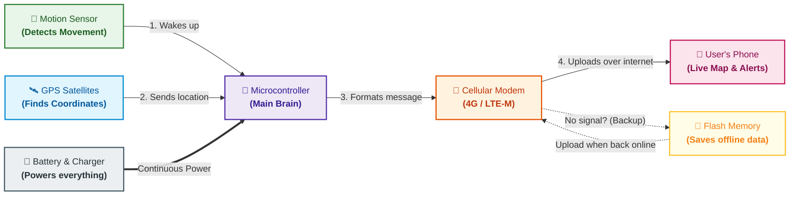

# System Architecture: AtlasTag

*Status: DRAFT (Under Research Phase)*

---

## Visual Architecture & Flow

A simple, single-view diagram showing how AtlasTag tracks assets and delivers location updates to the user.

---

## How It Works (The 5-Step Flow)

1. **Sleeps to Save Battery:** Most of the time, the device stays asleep to last months on a small battery.
2. **Wakes Up on Movement:** When someone moves the tracked object, the motion sensor detects it and immediately wakes the brain (microcontroller).
3. **Finds Its Location:** The GPS receiver powers on, connects to satellites, and locks the exact coordinates (latitude and longitude). If indoors, it uses nearby cellular towers as a fallback.
4. **Sends Location to Your Phone:** The cellular modem wakes up and sends the location packet over 4G LTE-M to the cloud, updating the mobile app in real time.
5. **Offline Safety Net:** If the device is out of cellular coverage (e.g., in a basement or shipping container), it saves the location history to internal flash memory and uploads everything automatically once signal returns.

---

## Power System
- **Battery:** 3.7V rechargeable Li-Po battery (~400–800 mAh).
- **Charging:** Standard USB-C charging with built-in battery management (PMIC).
- **Efficiency:** Turns off GPS and cellular antennas between updates to achieve under 10 µA standby current.

---

## Location Strategy
- **Outdoor:** High-accuracy GPS / GNSS (< 5 meters).
- **Indoor Fallback:** Cellular tower triangulation if satellite signals are blocked.

---

## Sleep & Wake Triggers
- **Motion Trigger:** Wakes immediately when movement or vibration is detected.
- **Heartbeat Timer:** Wakes periodically (e.g., once every 12 hours) even if stationary to report battery status and check in.
- **Charger Trigger:** Wakes automatically when plugged into USB-C.

---

## Hardware Component Summary

| Role | Component Candidate | Purpose |
| :--- | :--- | :--- |
| **Main Brain & Modem** | Nordic nRF9151 / Quectel BG95 | Runs device logic, reads GPS, connects to 4G LTE-M |
| **Motion Sensor** | ST LIS2DW12 | Ultra-low power accelerometer that detects motion |
| **Power Manager (PMIC)** | Nordic nPM1300 / Discrete PMIC | Safely charges battery via USB-C and manages power rails |
| **Offline Memory** | SPI NOR Flash | Stores unsent location records when off-grid |
| **SIM Card** | Solderable eSIM / Nano-SIM | Provides global cellular network connectivity |
