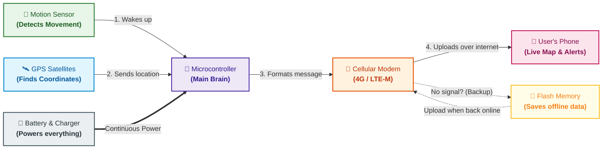

# System Architecture: AtlasTag

*Status: DRAFT (Under Research Phase)*

---

## Visual Architecture & Flow

A simple, single-view diagram showing how AtlasTag tracks assets and delivers location updates to the user.

---

## How It Works (The 5-Step Flow)

1. **Sleeps to Save Battery:** Most of the time, the device stays asleep to last months on a small battery.
2. **Wakes Up on Movement:** When someone moves the tracked object, the motion sensor detects it and immediately wakes the brain (microcontroller).
3. **Finds Its Location:** The GPS receiver powers on, connects to satellites, and locks the exact coordinates (latitude and longitude). If indoors, it uses nearby cellular towers as a fallback.
4. **Sends Location to Your Phone:** The cellular modem wakes up and sends the location packet over 4G LTE-M to the cloud, updating the mobile app in real time.
5. **Offline Safety Net:** If the device is out of cellular coverage (e.g., in a basement or shipping container), it saves the location history to internal flash memory and uploads everything automatically once signal returns.

---

## Power System
- **Battery:** 3.7V rechargeable Li-Po battery (~400–800 mAh).
- **Charging:** Standard USB-C charging with built-in battery management (PMIC).
- **Efficiency:** Turns off GPS and cellular antennas between updates to achieve under 10 µA standby current.

---

## Location Strategy
- **Outdoor:** High-accuracy GPS / GNSS (< 5 meters).
- **Indoor Fallback:** Cellular tower triangulation if satellite signals are blocked.

---

## Sleep & Wake Triggers
- **Motion Trigger:** Wakes immediately when movement or vibration is detected.
- **Heartbeat Timer:** Wakes periodically (e.g., once every 12 hours) even if stationary to report battery status and check in.
- **Charger Trigger:** Wakes automatically when plugged into USB-C.

---

## Hardware Component Summary

| Role | Component Candidate | Purpose | Iron-Only Assembly Feasibility |
| :--- | :--- | :--- | :--- |
| **Main Brain & Modem** | Nordic nRF9151 / Quectel BG95-M3 / SIM7080G | Runs device logic, reads GPS, connects to NB-IoT/LTE-M | PENDING (Via Mezzanine Header) |
| **Battery Charger** | Microchip MCP73831 (SOT-23-5) | Safe CC/CV single-cell Li-Po charging from USB-C | 100% Solderable (Gull-wing leads) |
| **System Voltage Regulator** | Diodes Inc AP2112K-3.3 (SOT-23-5) / Low-IQ LDO | Regulated 3.3V rail for host, flash, and sensors | 100% Solderable (Gull-wing leads) |
| **Motion Sensor** | ST LIS2DW12 / Pre-soldered MEMS Breakout | Ultra-low power accelerometer for motion wake | Header Breakout (Bare LGA unresolved) |
| **Offline Memory** | Winbond W25Q32JVSSIQ (SOIC-8) | Stores unsent location records when off-grid | 100% Solderable (1.27 mm gull-wing) |
| **SIM Card Socket** | Molex 104224-0820 Nano-SIM | Provides cellular network carrier interface | Solderable perimeter SMT pads |
| **Modem Interface Header** | Dual-Row 2.54mm Mezzanine Header | Decouples modem footprint from baseboard | 100% Solderable Through-Hole |

---

## Modular Prototype Architecture (Baseboard + Mezzanine)

To decouple unverified fine-pitch modem footprints and enable iron-only hand assembly during Week 1, AtlasTag implements a modular architecture:
- **Baseboard (45 × 35 mm):** Contains the 100% iron-solderable power path (USB-C, MCP73831 charger, 3.3V LDO), battery monitor, Winbond SOIC-8 flash, Nano-SIM socket, status LEDs, and sensor breakout header.
- **Modem Mezzanine Header:** Standardized 12-pin interface providing VBAT (burst power), 3.3V, GND, UART (TX/RX/RTS/CTS), control GPIOs (PWRKEY, RESET, STATUS), and SIM lines.
- **Trade-Offs:**
  - *Size:* Adds ~3–5 mm in vertical Z-stack height compared to a monolithic SiP, while remaining compact (45×35 mm).
  - *RF:* Eliminates high-risk RF microstrip routing on the baseboard; antenna matching remains on the modem module/carrier or connects via U.FL.
  - *Power:* High-current burst capability maintained by dual parallel VBAT and GND pins.

