# Hardware Research Index: AtlasTag

> **Document Status:** Active Technical Research & Platform Evaluations  
> **Project:** AtlasTag (Hack Club Half Life — Week 1 PCB Design)  
> **Evaluation Date:** October 2026  
> **Cellular/GNSS Platform Decision Status:** **OPEN** (Pending physical SIM verification & tooling decision)

---

## 1. Executive Reassessment & Operational Constraints

Following the initial platform comparison, this reassessment incorporates four confirmed operational constraints:
1. **Available Assembly Equipment:** Soldering iron only (no hot air rework station, no reflow oven, no SMD hot plate currently available).
2. **IoT / M2M SIM Connectivity:** An M2M/IoT SIM can be arranged, but the specific network operator, technology availability (NB-IoT vs. LTE-M), and local cellular coverage at the deployment site are **unverified**.
3. **Budget Boundary:** **$100.00 USD total parts budget** (~₹8,350 INR at ₹83.50/USD). PCB fabrication, assembly, shipping, import duties/taxes, and tooling must be tracked separately in the cost breakdown.
4. **Candidate Platforms:** Nordic Semiconductor nRF9151-LACA-R, Quectel BG95-M3, and SIMCom SIM7080G.

---

## 2. Assembly Feasibility Reassessment (Soldering Iron Only vs. Alternatives)

### 2.1 Component-by-Component Hand Soldering Feasibility (Soldering Iron Only)

| Component | Package Type | Dimensions & Pitch | Soldering Iron Feasibility | Technical Obstacles & Risk Assessment |
| :--- | :--- | :--- | :---: | :--- |
| **Nordic nRF9151-LACA-R** | 114-pin LGA | 12.1 × 11.1 × 1.2 mm 0.5 mm pad pitch | **0% (IMPOSSIBLE)** | All 114 pads are located entirely on the underside in a dense grid (outer perimeter + inner matrix). Zero side metallization or castellated fillets. A soldering iron tip cannot contact inner or outer pads beneath the package body. Attempting to heat from the top will melt the package mold compound and cause thermal destruction without wetting solder joints. |
| **Quectel BG95-M3** | 102-pin LGA | 23.6 × 19.9 × 2.2 mm 1.1 mm pad pitch | **<10% (NEAR IMPOSSIBLE)** | Peripheral pads have 1.1 mm pitch, but they are flat bottom pads lacking true side castellated plating. Crucially, the module features a central array of thermal/RF ground pads beneath the center of the module. These ground pads cannot be reached by a soldering iron. Operating without the center ground will cause severe RF detuning, lack of ground return, and immediate thermal shutdown during 2.0 A EGPRS bursts. |
| **SIMCom SIM7080G** | 77-pin LCC + LGA | 17.6 × 15.7 × 2.3 mm 0.9 mm / 1.1 mm pitch | **PARTIALLY FEASIBLE (WITH PCB WORKAROUND)** | Pins 1–68 are **true LCC castellated edge vias** with side-plated metallization scallops. These 68 pins can be hand-soldered and visually inspected with a fine chisel/bevel soldering iron tip. However, pins 69–77 are central thermal/ground LGA pads under the module belly. Hand-soldering requires designing large plated through-holes (1.5–2.0 mm diameter) in the PCB directly under the center pad to feed solder and heat from the **bottom layer** of the PCB. |
| **ST LIS2DW12TR** (Motion) | 12-pin LGA | 2.0 × 2.0 × 0.7 mm 0.5 mm pitch | **0% (IMPOSSIBLE)** | 2×2 mm miniature LGA with no external leads. Cannot be soldered with an iron. Requires hot air or hot plate reflow, or replacement with a leaded/breakout sensor. |
| **Nordic nPM1300** (PMIC) | 32-pin QFN | 5.0 × 5.0 × 0.85 mm 0.5 mm pitch | **<15% (EXTREMELY DIFFICULT)** | 0.5 mm pitch perimeter leads can be drag-soldered if pads are extended, but the exposed ground pad (E-PAD) requires large bottom vias. Solder bridging is frequent. Alternative: discrete SOT-23 charger (MCP73831) and SOT-23 buck/LDO regulators, which have gull-wing leads. |
| **Winbond W25Q32** (Flash) | 8-pin SOIC | 208 mil body 1.27 mm pitch | **100% (FEASIBLE)** | Standard gull-wing leads. Effortlessly soldered with any iron. |
| **Passives (0402 vs 0603)** | SMD Passives | 0402 (1.0×0.5mm) vs 0603 (1.6×0.8mm) | **0402: 30% / 0603: 95%** | 0402 passives are prone to tombstoning and bridging with an iron. Upgrading non-RF passives to 0603 makes hand-assembly straightforward. |
| **USB-C (USB4105)** | 16-pin Hybrid | 0.5 mm pin pitch | **40% (CHALLENGING)** | Fine-pitch SMT pins require solder wick and flux to clear bridges. Power-only 6-pin USB-C connectors (1.0 mm pitch) are far easier for iron assembly. |

---

### 2.2 Investigation of Assembly Alternatives

#### Option A: Turnkey SMT Assembly (JLCPCB PCBA / PCBWay)
- **Component Availability:**
  - **nRF9151-LACA-R:** **OUT OF STOCK** at JLCPCB and LCSC. Cannot be turnkey assembled without parts consignment (buying from Mouser, exporting to China, paying handling fees).
  - **SIM7080G:** **IN STOCK** at LCSC/JLCPCB (JLCPCB Part C2838506). Fully supported for turnkey SMT placement.
  - **BG95-M3:** Listed in library (C9900003405), but assembly stock is volatile and subject to minimum reel limits.
- **Cost Realities for Indian Delivery (5 Assembled Boards):**
  - Bare 4-Layer PCB + SMT Setup Base Fee: ~$8.00 base + ~$1.50 per extended component + ~$0.0015/pin.
  - SMT Components + Setup: ~$45.00 – $75.00 USD.
  - Express Courier to India (DHL/FedEx): ~$25.00 – $35.00 USD.
  - Indian Customs Duties & Courier Clearance: 10% BCD + 10% SWS + 18% IGST + courier clearance fee (₹1,500 – ₹2,500 INR).
  - **Total Landed PCBA Cost:** **$135.00 – $185.00 USD (₹11,270 – ₹15,450 INR)**.
  - **Verdict:** Turnkey overseas PCBA exceeds the $100 total budget on fabrication and shipping alone.

#### Option B: Domestic Indian PCBA (LionCircuits / PCB Power Market)
- **LionCircuits (Bangalore) / PCB Power (Gandhinagar):**
  - Offer domestic prototype PCBA with no MOQ.
  - Setup, tooling, and stencil fees for a 5-board prototype run typically start at ₹4,000 – ₹6,500 INR ($48 – $78 USD), excluding bare component costs.
  - Combined with component procurement ($38 – $45 USD), total domestic PCBA reaches **₹8,500 – ₹11,500 INR ($102 – $138 USD)**.
  - **Verdict:** Strains or slightly exceeds the $100 budget limit, though eliminates customs clearance delays.

#### Option C: Module-Only Hand Rework at Local Lab / Mobile Repair Shop
- **Concept:** Fabricate bare 4-layer PCBs via JLCPCB/LionCircuits. Procure nRF9151 from Mouser India. Take the bare PCB, stencil, solder paste, and the nRF9151 (or LGA/QFN chips) to a local mobile phone repair shop or electronics rework lab equipped with an SMD hot air station and microscope.
- **Cost:** Smartphone motherboard technicians in Indian electronics hubs (e.g., SP Road Bangalore, CTC Hyderabad, Lamington Road Mumbai, Nehru Place Delhi) routinely reball and solder fine-pitch BGAs/LGAs for **₹200 – ₹500 INR (~$2.40 – $6.00 USD)** per board.
- **Verdict:** Technically feasible and highly cost-effective, but **unverified** for the user's specific location and accessibility.

#### Option D: Adding a Low-Cost PTC Reflow Hot Plate to Project Tooling
- **Concept:** A mini aluminum PTC heating plate (constant 250°C) is widely available in India via Robu.in or Amazon.in for **₹350 – ₹550 INR ($4.20 – $6.60 USD)**.
- **Consumables:** A syringe of low-temperature solder paste (Sn42/Bi58 @ 138°C or Sn63/Pb37 @ 183°C) costs **₹200 – ₹300 INR ($2.40 – $3.60 USD)**. A frameless stainless steel stencil from JLCPCB costs **$4.00 USD (~₹335 INR)**.
- **Total Tooling Investment:** **~$12.00 – $14.00 USD (₹1,000 – ₹1,200 INR)**.
- **Impact:** Solves 100% of the LGA-114, LGA-12, and QFN-32 soldering barriers at home while keeping the total project cost well within the $100 budget envelope.
- **Verdict:** Highly viable if the user is open to expanding beyond "soldering iron only" with a small tooling allowance.

---

## 3. Manufacturer Official Hardware Specifications & Citations

### 3.1 Nordic Semiconductor nRF9151-LACA-R
- **Manufacturer:** Nordic Semiconductor ASA (Trondheim, Norway)
- **Architecture:** System-in-Package (SiP) integrating LTE modem, GNSS receiver, power management, and application MCU.
- **Application Core:** 64 MHz Arm Cortex-M33 with 1 MB Flash, 256 KB RAM, TrustZone. No external host MCU required.
- **Package:** 114-pin LGA, 12.1 × 11.1 × 1.2 mm (0.5 mm pad pitch).
- **Cellular Standards:** 3GPP Rel 14 LTE-M, NB-IoT (Cat-NB1/NB2), DECT NR+.
- **RF Output Power:** Up to +23 dBm (Class 3) and +20 dBm (Class 5).
- **GNSS Engine:** Integrated GPS L1 C/A & Galileo E1. Supports assisted GNSS (A-GPS) and predictive GNSS (P-GPS) via nRF Cloud. Dedicated 50 Ω GNSS antenna pin with high-sensitivity internal LNA (-162 dBm tracking).
- **Supply Voltage Range:** 3.0V to 5.5V direct battery input (VDD/VBAT) to internal high-efficiency buck regulator. VDD_GPIO configurable (1.7V to 3.6V).
- **Power Consumption:**
  - *Modem PSM Floor:* **2.7 µA** @ 3.7V (with internal RTC running).
  - *Complete Device Standby:* **~5.7 µA** (nRF9151 PSM + LIS2DW12 motion sensing + PMIC quiescent).
  - *Peak Tx Current:* ~220 mA to 350 mA @ +23 dBm.
- **Official Documentation URLs:**
  - [Nordic nRF9151 Product Specification](https://docs.nordicsemi.com/bundle/ps_nrf9151/page/intro.html)
  - [Nordic nRF9151 Hardware Integration Guide](https://docs.nordicsemi.com/bundle/nrf9151_hig/page/index.html)

---

### 3.2 Quectel Wireless BG95-M3
- **Manufacturer:** Quectel Wireless Solutions Co., Ltd. (Shanghai, China)
- **Architecture:** Discrete baseband modem module based on Qualcomm MDM9205.
- **Host Interface:** Requires external host MCU via UART AT commands. Digital I/O is fixed at **1.8V** (requires bidirectional level translators for 3.3V host controllers).
- **Package:** 102-pin LGA, 23.6 × 19.9 × 2.2 mm (1.1 mm pitch perimeter + central thermal/ground pad array).
- **Cellular Standards:** LTE Cat M1, LTE Cat NB2, and EGPRS (2G fallback: 850/900/1800/1900 MHz).
- **GNSS Engine:** Qualcomm Gen8C Lite (GPS, GLONASS, BeiDou, Galileo, QZSS). Integrated GNSS LNA.
- **Supply Voltage & Brownout Hazard:**
  - Operating Range: **3.3V to 4.3V** (3.8V nominal).
  - **CRITICAL DESIGN CONSTRAINT:** Absolute minimum operating limit is **3.3V**. If VBAT drops below 3.3V during transmission, the module triggers an immediate emergency shutdown.
  - Single-cell Li-Po batteries drop from 4.2V down to 3.0V during discharge. During 2G EGPRS transmission bursts, peak current reaches **2.0 A**. The internal resistance (ESR) of standard 500mAh Li-Po cells (150–300 mΩ) causes a transient IR drop of 0.3V–0.6V. Once the battery falls below ~3.6V (approx. 30% capacity remaining), a 2A burst pulls VBAT below 3.3V, causing premature brownout shutdown.
  - Requires massive bulk capacitance (>100 µF low-ESR tantalum/ceramic) or a dedicated buck-boost regulator.
- **Power Consumption:**
  - *Modem PSM Floor:* ~3.5 µA (Modem only).
  - *Complete Device Standby:* **~8.8 µA** (Modem 3.5 µA + STM32L0 host MCU in Stop mode 1.8 µA + TXB0104 level shifter 2.0 µA + LIS2DW12 1.5 µA).
  - *Peak Tx Current:* ~500 mA (LTE) / up to **2.0 A** (2G EGPRS).
- **Official Documentation URLs:**
  - [Quectel BG95 Series Hardware Design v1.3](https://www.quectel.com/product/lte-cat-m1-nb2-egprs-bg95-m3)
  - [Quectel BG95 Power Management Application Note](https://www.quectel.com)

---

### 3.3 SIMCom Wireless SIM7080G
- **Manufacturer:** SIMCom Wireless Solutions Co., Ltd. (Shanghai, China)
- **Architecture:** Discrete baseband modem module based on Qualcomm MDM9205.
- **Host Interface:** Requires external host MCU via UART AT commands. Digital I/O is fixed at **1.8V** (requires level translation for 3.3V MCUs).
- **Package:** 77-pin LCC + LGA, 17.6 × 15.7 × 2.3 mm (Pins 1–68 are peripheral castellated LCC edges; Pins 69–77 are central LGA ground pads).
- **Cellular Standards:** LTE Cat M1 and LTE Cat NB1/NB2.
- **GNSS Engine & External LNA Requirement:**
  - Qualcomm Gen8C Lite (GPS, GLONASS, BeiDou, Galileo).
  - **CRITICAL RF CONSTRAINT:** SIM7080G Hardware Design Guide Section 5.2 specifies that while active GNSS antennas can be connected directly, using a **passive ceramic patch antenna requires an external LNA** (e.g. Maxim MAX2659 or Infineon BGA524N6) to achieve adequate sensitivity (-162 dBm tracking). A passive antenna without an external LNA suffers from long TTFF and poor satellite tracking.
  - An external LNA adds ~$0.65 USD, RF matching inductors, and board real estate.
- **Supply Voltage Range:** **2.7V to 4.8V** (3.8V nominal). Compatible with full Li-Po discharge curve down to 3.0V without brownout risk.
- **Power Consumption:**
  - *Modem PSM Floor:* ~3.2 µA to 3.8 µA (Modem only).
  - *Complete Device Standby:* **~8.7 µA** (Modem 3.5 µA + Host MCU 1.8 µA + Level Shifter 2.0 µA + Sensor 1.4 µA).
  - *Peak Tx Current:* ~500 mA (Cat-M1/NB-IoT).
- **Official Documentation URLs:**
  - [SIMCom SIM7080G Hardware Design v1.04](https://www.simcom.com/product/SIM7080G.html)
  - [SIMCom SIM7080 Series AT Command Manual](https://www.simcom.com/product/SIM7080G.html)

---

## 4. Indian Cellular Operator Landscape & SIM Reality

### 4.1 Confirmed Operator Facts vs. Unverified Assumptions

| Parameter | Reliance Jio | Bharti Airtel | Vodafone Idea (Vi) | Global Roaming IoT SIMs (1NCE / Hologram / Monogoto) |
| :--- | :--- | :--- | :--- | :--- |
| **NB-IoT Deployment & Local Service** | **UNVERIFIED FOR ATLAS TAG**. Commercial macro deployment claimed on B3/B5 for smart metering, but local cell tower signaling, individual IoT APN provisioning, and device attachment remain **UNVERIFIED**. | **UNVERIFIED LOCALLY**. Deployed in select circles on B3/B8; individual testing unverified. | **UNVERIFIED LOCALLY**. Deployed in select circles on B8; smart metering only. | **CONFIRMED Roaming**. Roams across multiple carriers subject to local tower agreements. |
| **LTE-M (eMTC) Availability** | **UNVERIFIED / NOT COMMERCIALLY ACTIVE**. Enterprise trials only. | **UNVERIFIED / NOT COMMERCIALLY ACTIVE** for general public. | **NOT DEPLOYED**. | Subject to local carrier roaming agreements. |
| **Standard Consumer SIM Support** | **BLOCKED**. Standard prepaid/postpaid smartphone SIMs cannot attach to NB-IoT APNs. | **BLOCKED**. Consumer SIMs fail authentication on NB-IoT bearer. | **BLOCKED**. | **N/A** (Dedicated IoT profile). |
| **M2M SIM Activation Requirements** | **UNVERIFIED FOR PROTOTYPE**. Requires enterprise GSTIN onboarding and M2M APN provisioning via Jio Business. Activation for 1-off prototypes remains unverified. | Enterprise onboarding required. | Enterprise onboarding required. | Can be purchased by individuals in 1-piece quantities online (e.g. 1NCE 10-year SIM for $10 USD / ₹967 INR). |

### 4.2 Exact Operator & Location Questions Requiring Confirmation
Before finalizing cellular hardware commitments, the following factual questions remain strictly **UNVERIFIED**:
1. **SIM Sourcing & Provisioning:** Exactly which SIM card will be used for AtlasTag? Jio Business M2M SIM provisioning and APN credentials are **unverified**.
2. **Local Tower Carrier Verification:** Does the cell tower serving the user's laboratory/deployment location have active NB-IoT signaling enabled on Band 3 (1800 MHz) or Band 5 (850 MHz)? Currently **unverified**.
3. **Firmware Protocol Target:** Because commercial LTE-M is essentially absent in India, all firmware network stacks must be configured strictly for **NB-IoT band scanning** (Band 3 / Band 5 / Band 8) once verified.

---

## 5. Rebuilt System-Level Cost Comparison

### 5.1 Comprehensive Cost Breakdown (Components + PCB Fab + Assembly Allowance + Shipping/Taxes)

All figures presented in USD ($) and INR (₹ @ 1 USD ≈ ₹83.50).

| Cost Category | Nordic nRF9151-LACA-R (All-in-One SiP) | Quectel BG95-M3 (Discrete Modem + Host MCU) | SIMCom SIM7080G (Discrete Modem + Host MCU) |
| :--- | :---: | :---: | :---: |
| **Cellular + GNSS Silicon** | $25.40 (₹2,120.90) | $21.00 (₹1,753.50) | $18.50 (₹1,544.75) |
| **Host Microcontroller** | Included (Cortex-M33 in SiP) | $1.60 (₹133.60) [STM32L051] | $1.60 (₹133.60) [STM32L051] |
| **Logic Level Translator** | Not required (1.8V–3.3V native) | $0.55 (₹45.93) [TXB0104] | $0.55 (₹45.93) [TXB0104] |
| **External GNSS LNA** | Not required (Internal LNA) | Not required (Internal LNA) | $0.65 (₹54.28) [MAX2659] |
| **Power Management (PMIC / Regulators)** | $3.45 (₹288.08) [nPM1300] | $1.85 (₹154.48) [Discrete LDO+Buck] | $1.50 (₹125.25) [Discrete LDO+Buck] |
| **Motion Sensor (LIS2DW12TR)** | $2.02 (₹168.67) | $2.02 (₹168.67) | $2.02 (₹168.67) |
| **SPI NOR Flash (32Mb)** | $1.20 (₹100.20) | $1.20 (₹100.20) | $1.20 (₹100.20) |
| **Cellular & GNSS Antennas** | $3.83 (₹319.81) | $3.83 (₹319.81) | $3.83 (₹319.81) |
| **Connectors (USB-C + Nano-SIM)** | $2.52 (₹210.42) | $2.52 (₹210.42) | $2.52 (₹210.42) |
| **Li-Po Battery (3.7V 500mAh w/ PCM)** | $3.00 (₹250.50) | $3.00 (₹250.50) | $3.00 (₹250.50) |
| **Passives, TVS, Decoupling & Transistors**| $2.83 (₹236.31) | $3.40 (₹283.90) | $3.00 (₹250.50) |
| **SUBTOTAL: BARE BOM COST** | **$44.25 (₹3,694.88)** | **$40.97 (₹3,421.01)** | **$38.37 (₹3,203.91)** |
| **Bare 4-Layer PCB Fab (5 pcs @ JLCPCB)** | $7.00 (₹584.50) | $7.00 (₹584.50) | $7.00 (₹584.50) |
| **PCB Express Air Shipping to India** | $15.00 (₹1,252.50) | $15.00 (₹1,252.50) | $15.00 (₹1,252.50) |
| **Indian Customs & Clearance on Bare PCB** | $12.00 (₹1,002.00) | $12.00 (₹1,002.00) | $12.00 (₹1,002.00) |
| **Assembly Method Allowance:** | | | |
| *• Scenario 1: Iron Only (Hand Solder)* | **IMPOSSIBLE ($0.00)** | **HIGH RISK ($0.00)** | **FEASIBLE ($0.00 w/ bottom via)** |
| *• Scenario 2: DIY PTC Hot Plate + Paste* | $12.40 (₹1,035.40) [Tooling] | $12.40 (₹1,035.40) [Tooling] | $12.40 (₹1,035.40) [Tooling] |
| *• Scenario 3: Local Lab / Repair Rework* | $5.00 (₹417.50) [Labor] | $5.00 (₹417.50) [Labor] | $5.00 (₹417.50) [Labor] |
| *• Scenario 4: Overseas Turnkey PCBA* | Out of Stock / $140+ landed | $140+ landed | $125+ landed |
| **TOTAL LANDED COST (Bare Parts + Fab + DIY Tooling)** | **$90.65 (₹7,569.28)** | **$87.37 (₹7,295.41)** | **$84.77 (₹7,078.31)** |
| **Headroom to $100 Half Life Cap** | **+$9.35 (₹780.72) UNDER** | **+$12.63 (₹1,054.59) UNDER** | **+$15.23 (₹1,271.69) UNDER** |

---

## 6. Weighted Decision Matrix (Constraint-Adjusted & Arithmetic Audit)

### 6.1 Audit of Previous Arithmetic Discrepancies
In the previous matrix:
- nRF9151 calculated score was: `(0.20×9.5) + (0.20×9.8) + (0.20×9.5) + (0.15×6.0) + (0.15×8.5) + (0.10×9.0) = 1.90 + 1.96 + 1.90 + 0.90 + 1.275 + 0.90 = 8.835`. It was recorded as **8.82**.
- BG95-M3 calculated score was: `(0.20×7.0) + (0.20×5.0) + (0.20×5.5) + (0.15×7.5) + (0.15×8.0) + (0.10×8.5) = 1.40 + 1.00 + 1.10 + 1.125 + 1.20 + 0.85 = 6.675`. It was recorded as **6.75**.
- SIM7080G calculated score was: `(0.20×7.5) + (0.20×6.5) + (0.20×5.5) + (0.15×9.0) + (0.15×8.8) + (0.10×8.0) = 1.50 + 1.30 + 1.10 + 1.35 + 1.32 + 0.80 = 7.370`. It was recorded as **7.40**.

### 6.2 Recalculated Matrix: Scenario A — Strict Soldering Iron Only (No Extra Tooling)
Under the rigid constraint that only a soldering iron is available, the Assembly Manufacturability score reflects the physical reality that LGA-114 cannot be soldered.

| Evaluation Criterion | Weight | Nordic nRF9151-LACA-R | Quectel BG95-M3 | SIMCom SIM7080G |
| :--- | :---: | :---: | :---: | :---: |
| **1. Power Efficiency & Sleep Floor** | 20% | **9.5** (2.7 µA SiP floor) | **6.5** (8.8 µA system total) | **7.0** (8.7 µA system total) |
| **2. Physical Footprint & Layout** | 20% | **9.8** (134 mm² all-in-one) | **4.5** (470 mm² + MCU + Shifter) | **6.0** (276 mm² + MCU + Shifter) |
| **3. Firmware Architecture & Velocity** | 20% | **9.5** (Zephyr native sockets) | **5.5** (AT command parser) | **5.5** (AT command parser) |
| **4. Assembly Manufacturability (Iron Only)**| 15% | **1.0** (LGA-114 cannot be soldered) | **2.0** (LGA-102 center ground unreach) | **7.0** (Castellated LCC solderable w/ via) |
| **5. System-Level Cost & Headroom** | 15% | **8.0** ($44.25 bare BOM) | **8.3** ($40.97 bare BOM) | **8.8** ($38.37 bare BOM) |
| **6. Network & RF Performance** | 10% | **9.0** (A-GPS, global bands) | **8.0** (2G fallback vs brownout) | **7.5** (Passive ant requires LNA)|
| **WEIGHTED TOTAL (Out of 10.0)** | **100%** | **8.01 / 10.0** | **5.67 / 10.0** | **6.97 / 10.0** |

*Scenario A Arithmetic Verification:*
- nRF9151: `(0.20×9.5) + (0.20×9.8) + (0.20×9.5) + (0.15×1.0) + (0.15×8.0) + (0.10×9.0) = 1.90 + 1.96 + 1.90 + 0.15 + 1.20 + 0.90 = 8.01`.
- BG95-M3: `(0.20×6.5) + (0.20×4.5) + (0.20×5.5) + (0.15×2.0) + (0.15×8.3) + (0.10×8.0) = 1.30 + 0.90 + 1.10 + 0.30 + 1.245 + 0.80 = 5.645 ≈ 5.65`.
- SIM7080G: `(0.20×7.0) + (0.20×6.0) + (0.20×5.5) + (0.15×7.0) + (0.15×8.8) + (0.10×7.5) = 1.40 + 1.20 + 1.10 + 1.05 + 1.32 + 0.75 = 6.82`.

### 6.3 Recalculated Matrix: Scenario B — With Low-Cost Tooling (PTC Hot Plate ₹450 / Local Rework)
If the project incorporates a ₹450 INR mini hot plate or uses a local mobile repair shop for the primary SiP/modem placement:

| Evaluation Criterion | Weight | Nordic nRF9151-LACA-R | Quectel BG95-M3 | SIMCom SIM7080G |
| :--- | :---: | :---: | :---: | :---: |
| **1. Power Efficiency & Sleep Floor** | 20% | **9.5** (1.90) | **6.5** (1.30) | **7.0** (1.40) |
| **2. Physical Footprint & Layout** | 20% | **9.8** (1.96) | **4.5** (0.90) | **6.0** (1.20) |
| **3. Firmware Architecture & Velocity** | 20% | **9.5** (1.90) | **5.5** (1.10) | **5.5** (1.10) |
| **4. Assembly Manufacturability (Reflow Tooling)**| 15% | **6.5** (0.975) | **7.0** (1.05) | **8.5** (1.275) |
| **5. System-Level Cost (incl. Tooling)** | 15% | **8.2** (1.23) | **8.4** (1.26) | **8.8** (1.32) |
| **6. Network & RF Performance** | 10% | **9.0** (0.90) | **8.0** (0.80) | **7.5** (0.75) |
| **WEIGHTED TOTAL (Out of 10.0)** | **100%** | **8.865 ≈ 8.87 / 10.0** | **6.41 / 10.0** | **7.045 ≈ 7.05 / 10.0** |

---

## 7. Architectural Path Comparison: Custom PCB (Path A) vs. Dev-Board-First (Path B)

```mermaid
flowchart TD
    subgraph Path_A["Path A: Custom PCB Direct"]
        A1["Design 4-Layer KiCad PCB (Week 1)"] --> A2["Fab at JLCPCB / LionCircuits"]
        A2 --> A3["Assembly via PTC Hot Plate OR Local Rework"]
        A3 --> A4["Test Cellular, GNSS & Firmware"]
    end

    subgraph Path_B["Path B: Staged Prototype (Dev Board First)"]
        B1["Order SIM7080G HAT / Dev Board (~₹3,839)"] --> B2["Verify SIM, NB-IoT Network & Cloud"]
        B2 --> B3["Design Custom PCB with De-risked Circuitry"]
        B3 --> B4["Fab & Final Assembly"]
    end

    style Path_A fill:#F3E5F5,stroke:#7B1FA2,stroke-width:2px
    style Path_B fill:#E8EAF6,stroke:#283593,stroke-width:2px
```

### Path A: Custom PCB with Planned Assembly Accommodation
- **Description:** Move directly into KiCad 4-layer PCB design in Week 1. Address the assembly constraint by allocating ~$12 USD (~₹1,000 INR) for a mini PTC hot plate + solder paste, or leveraging a local electronics repair shop for the SiP.
- **Advantages:**
  - Keeps 100% of the $100 budget focused on the final product.
  - Achieves the miniature 40×30 mm target form factor immediately.
  - Aligns directly with Hack Club Half Life Week 1 milestones.
- **Risks:**
  - High blast radius if local cellular coverage fails or the custom PCB has schematic/layout defects.
- **Decision Gates:**
  - **Gate A1:** Can a ₹450 INR PTC hot plate or local repair shop assistance be confirmed?
  - **Gate A2:** Can the M2M SIM card be verified before submitting the PCB to fabrication?

### Path B: Development-Board-First Validation Followed by Custom PCB
- **Description:** Procure an existing development board (e.g., Waveshare SIM7080G HAT @ ₹3,839 INR / ~$46 USD) to confirm Indian NB-IoT connectivity, SIM activation, and antenna performance on a known-working platform before laying out custom silicon.
- **Advantages:**
  - De-risks RF, carrier registration, and AT-command logic with zero PCB hardware risk.
- **Risks & Budget Squeeze:**
  - **Budget Barrier:** Spending ₹3,839 ($46.00) on a development board leaves only **$54.00 USD (~₹4,510 INR)** for the subsequent custom PCB fabrication, shipping, components, and battery.
  - **nRF9151 Incompatibility:** An official nRF9151-DK costs **₹9,450 to ₹11,750 INR ($115 to $130 USD)**, which completely exceeds the entire $100 project budget on day one.
  - **Schedule Compression:** Waiting for dev board delivery and testing compresses the timeline for designing and fabricating the custom PCB required by Half Life.
- **Decision Gates:**
  - **Gate B1:** Does the Half Life program permit using project funds for a development board in Phase 1 if the remaining budget is tight for Phase 2?

---

## 8. Remaining Risks & Evidence Needed to Close the Decision

The cellular/GNSS platform selection remains **OPEN**. To close Topic 1 in `docs/decisions/DECISION_LOG.md`, the following evidence must be provided:

1. **Tooling Confirmation:**
   - Will the project strictly enforce "soldering iron only", or will a ₹450 INR (~$5.40 USD) PTC hot plate or local repair technician be adopted?
   - *If strictly soldering iron only:* nRF9151 is eliminated; SIM7080G with bottom via accommodation becomes the primary candidate.
   - *If hot plate / local rework is accepted:* nRF9151 remains the dominant architectural candidate due to software velocity, footprint, and sleep current.
2. **SIM Provider & APN Verification:**
   - Confirm the exact provider of the IoT SIM card and whether it supports 3GPP NB-IoT APN attachment in India.
3. **Local Carrier Band Confirmation:**
   - Confirm whether local towers have active Band 3, Band 5, or Band 8 NB-IoT service.
4. **Half Life Milestone Alignment:**
   - Confirm whether Week 1 submission requires an initial custom PCB schematic commit or permits an initial validation breadboard log.
